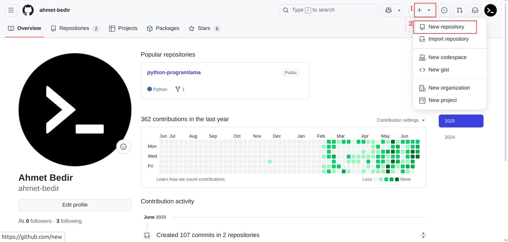
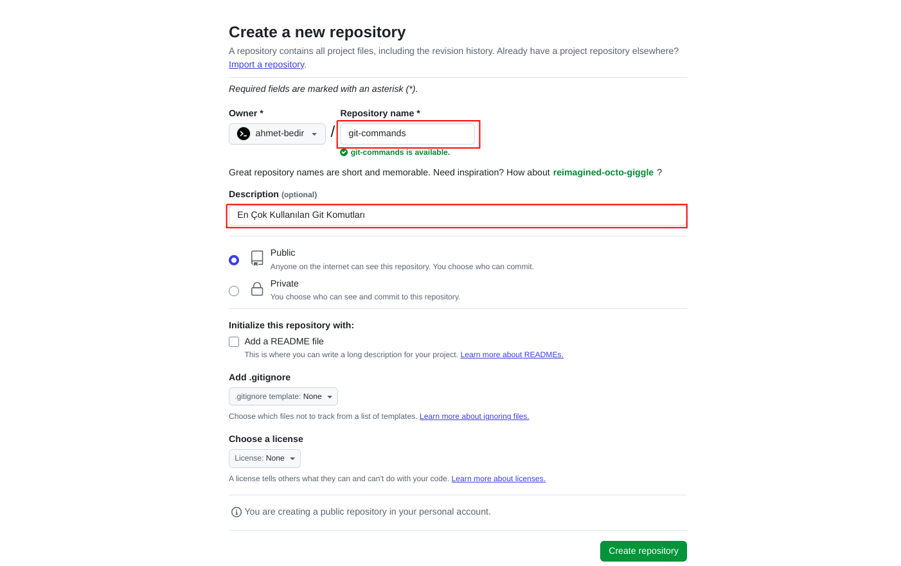
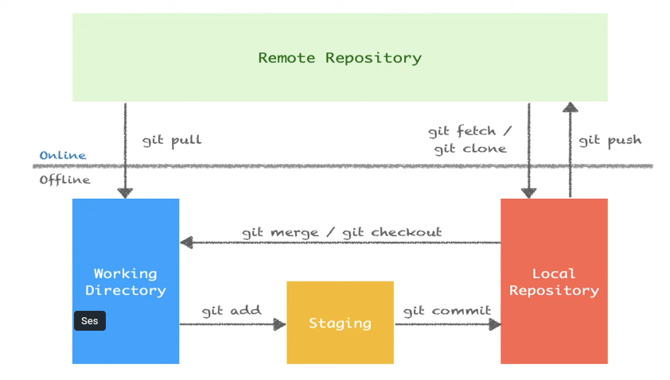

<h1 align="center">Git Komutları (Git Commands)<h1/>

---


---

##### Bu proje kapsamındaki türkçe kaynak `git-commands.pdf` dosyası aşağıdaki koşullarda kullanıma sunulmuştur:

#### Lisans: Creative Commons Zero v1.0 Universal (CC0 1.0)

1. Kopyalayabilir, değiştirebilir, dağıtabilir ve kullanabilirsiniz.
   *(You can copy, modify, distribute, and use the file)*

2. Ticari amaçlar için kullanabilirsiniz.  
   *(You may use it for commercial purposes)*

3. İzin almadan özgürce kullanabilirsiniz.
   *(You may use it freely without asking for permission)*

4. Atıf yapmanız gerekmez.
   *(Attribution is not required)*

5. Herhangi bir sınırlama veya kısıtlama yoktur.
   *(There are no limitations or restrictions)*
---


- Gitin sistemine kullanıcı adımızı ve e-mail adresimizi tanımlamak için:

```
git config --global user.name "user_name"
git config --global user.email "user_email"
```
<p><font size="2">Not : Depoya özgü kullanıcıadı va email tanımlama işlemi için --global anahtarı yerine --local anahtarı veya hiç yazılmaması gerekir.</font></p>


- Tanımlamış olduğumuz kullanıcı adı ve email adresini görüntülemek için:

```
git config --global user.name || git config --global --get user.name
git config --global user.email || git config --global --get user.email
git config --list || git config -l
```

- Git varsayılan editörünü nano ayarlamak için:
```
git config --global core.editor "nano -w"
```

- Git varsayılan editörünü vim ayarlamak için:
```
git config --global core.editor "vim --nofork"
```

- Git varsayılan editörünü gedit (linux) ayarlamak için:
```
git config --global core.editor "gedit --wait --new-window"
```

- Git varsayılan editörünü emacs ayarlamak için:
```
git config --global core.editor emacs
```

- Git varsayılan editörü görüntülemek için:
```
git config --global core.editor
```


---

- Bulunduğun dizinde boş bir git deposu oluşturmak için:
> `git init`

- 0luşturmuş olduğumuz deponun güncel durum bilgisini görüntülemek için kullanabilirsiniz. Bu komut ile hangi branch'te olduğumuz veya hangi dosyaların staging alanında (index bölgesi) olduğu gibi bilgiler verir.
> `git status`

- İsmi verilen tek bir dosyayı staging alanına eklemek için:
> `git add <file_name>`

- Tüm dosyaları staging alanına eklemek için:
> `git add .`


- Staging alanına eklenmeden önce dosyada yapılan son değişiklikleri geri alır veya silinen dosyayı geri getirir.
```
git restore <file_name> || git checkout -- <file_name>
```

- Dosyayı staging alanından çıkarmak için:
```
git restore --staged <file_name> || git reset HEAD <file_name> || git rm --cached <file_name>
```


---

> `git rm <file_name>`  :  Dosya silmek için kullanılır.

> `git rm -r <directory_name/>`  :  Dizin silmek için kullanılır.

> `git mv <file_name> <new_file_name>`  :  Dosya adı değiştirmek için kullanılır.

> `git mv <file_name> <directory_name/>`  :  Dosyayı taşımak için kullanılır.

> `git mv <file_name> <directory_name/new_file_name>`  :  Dosyayı adını değiştirerek taşımak için kullanılır.

> `git config --global alias.<kısayol> <komut_adı>`  :  Komutları kısaltmak için kullanılır.

---


- Git ile yapılan değişikliklerin kaydedildiği bir işlemdir. Bu işlem sayesinde herhangi bir zamanda geriye dönülerek değişiklikler eski haline getirilebilir.
```
git commit -m "commit_mesajı"
```

> `git commit -a`  :  Git add yapmadan direk commit etme işlemi için kullanabilirsiniz.
> `git commit --amend -m "yeni commit mesajı"`  :  En son yapılan commit mesajını değiştirmek için kullanılır.


> `git log`  :  Yapılan commitleri gösterir.
> `git log --oneline`  :  Yapılan commitleri tek satır şeklinde gösterir.

HEAD  :  Git'in içinde bulunduğumuz konumu belirten bir referanstır. Genellikle en son commit'i işaret eder. Bu, nerede olduğumuzu ve hangi commit üzerinde çalıştığımızı belirlememizi sağlar.

> `.gitignore`  :  Git'in, belirtilen dosyaları görmezden gelmesine izin veren bir dosyadır. Proje kök dizinine eklenir.
> `dizin/*`        :  Dizin klasöründeki tüm dosyaları kapsar.
> `!dizin/b`      :  Dizin klasöründeki b dosyası hariç tüm dosyaları kapsar.


- Zamanı geri alma yani git deposunda geçmiş tarihli bir commit'e geri gitmemiz için:
```
git checkout <commit_id>
```

- Gittiğimiz yerden geri gelmemize yani son commite geri döner.
```
git checkout master || git switch master
```

- Git versiyon değiştirme (silinen tüm dosyaları geri getirmek) için:
```
git checkout <commit id> -- .
```


---

> `git diff`  :  Staging alanına eklenmeden önce tüm dosyalarda yapılan değişiklikleri gösterir.
>
>`git diff <file_name>`  :  Staging alanına eklenmeden önce ismi verilen tek bir dosyada yapılan değişiklikleri gösterir.
> 
> `git diff --staged`  :  Git deposu ile staging alanındaki değişiklikleri gösterir.


> `git branch`  :  Yerelimizde kaç dal (branch) olduğunu ve hangi dalda bulunduğumuzu gösterir.
>
>`git branch --all`  :  Yerelimizde ve uzak depodaki tüm dalları gösterir.
> 
>`git branch -r`  :  Uzak depodaki dalları gösterir.
> 
>`git branch --all`  :  Yerelimizde ve uzak depodaki tüm dalları gösterir.
>
> `git branch -r`  :  Uzak depodaki dalları gösterir.
> 
> `git branch <branch_name>`  :  Yeni dal (branch) oluşturmak için kullanılır.
> 
> `git branch -m <branch_name> <new_branch_name>`  :  Dal adını değiştirir, ancak yeni isimde bir dal varsa hata verir.
>
> `git branch -M <branch_name> <new_branch_name>`  :  Dal adını değiştirir, yeni isimde bir dal varsa üzerine yazar (force).
>
> `git branch -D <branch_name>`  :  Lokalde ismi verilen bir dalı (branch) silmek için kullanılır.


> `git switch <branch_name>`  :  Girilen branch'a  geçiş yapar.
>
>`git checkout <branch_name>`  :  Uzak depodan yerel depoya indirilen branch'a geçiş yapar.


> `git merge <branch_name>`  :  Master branch'ındayken ismi verilen diğer branch'ı master branch'ıyla birleştirmek için kullanılır.


---

> `git stash`  :  Git versiyon kontrol sistemi kullanılarak yapılan değişiklikleri geçici olarak kaydetmenizi sağlayan bir özelliktir. Bu, henüz tamamlanmayan bir iş üzerinde çalışırken veya bir dal üzerinde çalışırken aniden başka bir acil işle ilgilenmeniz gerektiğinde özellikle kullanışlıdır.

> `git stash list`  :  Kaydedilen tüm stash'leri listeler.
> `stash@{0}`  :  Git stash listesi içerisindeki ilk yani en son eklenen geçici değişiklikler listesindeki kaydedilmiş çalışma dizininin (working directory) saklandığı referans adıdır.

> `git stash apply`  :  En son kaydedilen stash'i geri yükler.
> `git stash apply stash@{n}`  :  Belirtilen numaralı stash'i geri yükler.

> `git stash drop`  :  En son kaydedilen stash'i siler.
> `git stash drop stash@{n}`  :  Belirtilen numaralı stash'i siler.

> `git stash pop`  :  Komutu, en son kaydedilen stash girdisini alır ve bu değişiklikleri uygular (apply) ve stash havuzundan (stash pool) kaldırır. Yani, pop işlemi stash havuzundan en son eklenen stash girdisini çıkarır ve çalışma dizinindeki değişiklikleri bu girdiye göre günceller.

> `git stash clear`  :  Komutu ise stash havuzundaki tüm stash girdilerini siler.

---

> `git reset <commit_id>`  :  Belirtilen bir commit'e geri dönmeyi sağlar ve bu işlem esnasında commit'ler silinir değişiklikler kalır.
> 
> `git reset --hard <commit_id>`  :  Belirtilen bir commit'e geri dönmeyi sağlar ve bu işlem esnasında commit'ler ve değişiklikler silinir.

> `git revert <commit_id>`  :  Belirli bir commit'i geri alırsınız ve bu işlem sonucunda yeni bir commit oluşur. Bu sayede, Git geçmişi değiştirilmez, ancak istenmeyen değişiklikler geri alınmış olur. 

---


### Remote
Remote uzun linkleri kısaltmamıza ve onları bir isim ile bağdaştırmamızı sağlar.

### GitHub’da Yeni Repo (Depo) Oluşturma Adımları

1. GitHub’a Giriş Yap
   - [github.com](https://github.com/) adresine git ve hesabına giriş yap.
2. Yeni Repo Oluştur
   - Sağ üstteki “+” (plus) simgesine tıkla.
   - Açılan menüden “New repository” seçeneğini seç.
3. Repo Bilgilerini Doldur
   - Repository name: Depoya vereceğin adı yaz.
   - Description (optional): Kısa bir açıklama ekleyebilirsin.
   - Public veya Private seç:
     - *Public* seçersen herkes görebilir.
     - *Private* seçersen sadece sen ve davet ettiklerin görebilir.
   - “Initialize this repository with:”
     - *README file* seçersen (isteğe bağlı), başlangıçta bir README dosyası ekler.
     - *.gitignore* ve *license* eklemek istersen (isteğe bağlı) buradan seçebilirsin.
4. Create repository butonuna tıkla.







---

- Yereldeki repoya uzak sunucudaki repoyu  ilişkilendirmek için uzak repo adresini https protokolü ile ekliyoruz.
```
git remote add <remote_name> https://github.com/<github_username>/<repo_name>.git
```


### PAT (Personal Access Token) Nedir, Ne İçin Kullanılır?

PAT (Personal Access Token) GitHub, GitLab gibi platformlarda kullanıcıların hesabına komut satırı (CLI) veya üçüncü parti uygulamalar üzerinden erişim sağlamak için kullandığı bir kimlik doğrulama yöntemidir. Özellikle şifre ile kimlik doğrulama devre dışı bırakıldığından, HTTPS ile erişimlerde şifre yerine PAT kullanılır.

Kullanım amaçları:

- Komut satırı veya uygulamalar üzerinden kimlik doğrulama yapmak
- Otomasyon scriptlerinde veya CI/CD süreçlerinde erişim sağlamak
- Klasik şifre ile giriş yerine, daha güvenli ve süreli erişim belirteçleri üretmek

---

### PAT Nasıl Oluşturulur?

1. GitHub hesabına giriş yap  
   Sağ üstteki profil fotoğrafına tıkla → **Settings** menüsüne gir.

2. Developer settings → Personal access tokens başlığına gel.

3. *Tokens (classic)* veya *Fine-grained tokens* sekmesini seç.

4. Generate new token butonuna tıkla.

5. Açılan formda:
   - Token'a bir isim ver (ör: "CLI erişimi için")
   - Erişim süresi (expiration) belirle
   - Hangi izinlere sahip olacağını seç (repo, workflow, user, vs.)

6. Generate token diyerek token'ı oluştur.  
   Oluşan token'ı güvenli bir yere kopyala (çünkü bir daha gösterilmez).

---

### Komut Satırında PAT ile Kimlik Doğrulama

- PAT’i kullanarak HTTPS ile push/pull işlemi yapmak için:

```
git remote set-url <remote_name> https://<github_username>:<pat>@github.com/<github_username>/<repo_name>.git
```
veya ilk push sırasında kullanıcı adı olarak GitHub kullanıcı adını, şifre olarak PAT’i girerek de kullanabilirsin.

<p style="font-size: 12px;">Not : Kısacası, PAT güvenli ve modern bir kimlik doğrulama yöntemidir ve GitHub gibi platformlarda şifreyle girişin yerini almıştır.<p/>


---

### Komut Satırında SSH ile Kimlik Doğrulama

1.SSH Anahtarınızı Oluşturma.
`ssh-keygen -t ed25519 -C "email@adresiniz.com"`
Varsayılan dosya yolunu (Enter’a basarak) ve bir şifre girip girmemeyi seçebilirsiniz.

2.Genel Anahtarı Kopyalayın.
`cat ~/.ssh/id_ed25519.pub`
Çıkan anahtarı kopyalayın.

3.Genel Anahtarı GitHub’a Ekleyin.
GitHub’da sağ üstte profil fotoğrafınıza tıklayın → Settings → SSH and GPG keys → New SSH key.
Title kısmına bir isim verin, kopyaladığınız anahtarı “Key” alanına yapıştırın ve kaydedin.

4.Bağlantıyı Test Edin.
`ssh -T git@github.com`
İlk seferde “Are you sure you want to continue connecting (yes/no/[fingerprint])?” sorusuna yes yazın. “Hi username! You've successfully authenticated...” mesajı görmelisiniz.

5.Depoyu SSH ile Kullanın : Depo bağlantı adresiniz şu şekilde olmalı.
`git@github.com:<github_username>/<repo_name>.git`

6.Var olan bir depoda HTTPS’i SSH’ye çevirmek için:
`git remote set-url <remote_name> git@github.com:<github_username>/<repo_name>.git`


---

> `git remote -v`  :  Yerele indirdiğiniz (klonladığınız) bir github deposunun hangi hesaptan veya hangi url üzerinden klonlandığını ve hangi yöntem ile bağlantı kulduğunu öğrenmek için kullanılır.

---


- Uzak sunucudaki repoya dosya göndermek için kullanabilirsiniz.
```
git push -u <remote_name> <branch_name>
```

- Fetch işlemi, uzak depodaki yeni değişiklikleri lokal depoya indirir ancak lokaldeki çalışma dizinine (working directory) birleştirmez. Bu işlem, uzak depodaki değişikliklerin var olup olmadığını kontrol etmek için kullanır.
```
git fetch <remote_name> <branch_name>
```

- Pull işlemi, uzak depodaki yeni değişiklikleri hem indirir hem de lokaldeki değişikliklerle birleştirir. Bu işlem, uzak depodaki değişiklikleri lokaldeki çalışma dizinine (working directory) eklemek istediğinizde kullanılır.
git pull = git fetch + git merge
```
git pull <remote_name> <branch_name>
```

- Bu komut, uzak depodaki tüm dosyaları, tarihçeyi ve yapılandırmayı https protokolü ile kopyalar ve lokalde yeni bir git deposu oluşturur.
```
git clone https://github.com/<github_username>/<repo_name>.git
```

- Bu komut, uzak depodaki tüm dosyaları, tarihçeyi ve yapılandırmayı ssh protokolü ile kopyalar ve lokalde yeni bir git deposu oluşturur.
```
git clone git@github.com:<github_username>/<repo_name>.git
```


<h3 align="center">Git Sistemi (Git System)<h3/>



